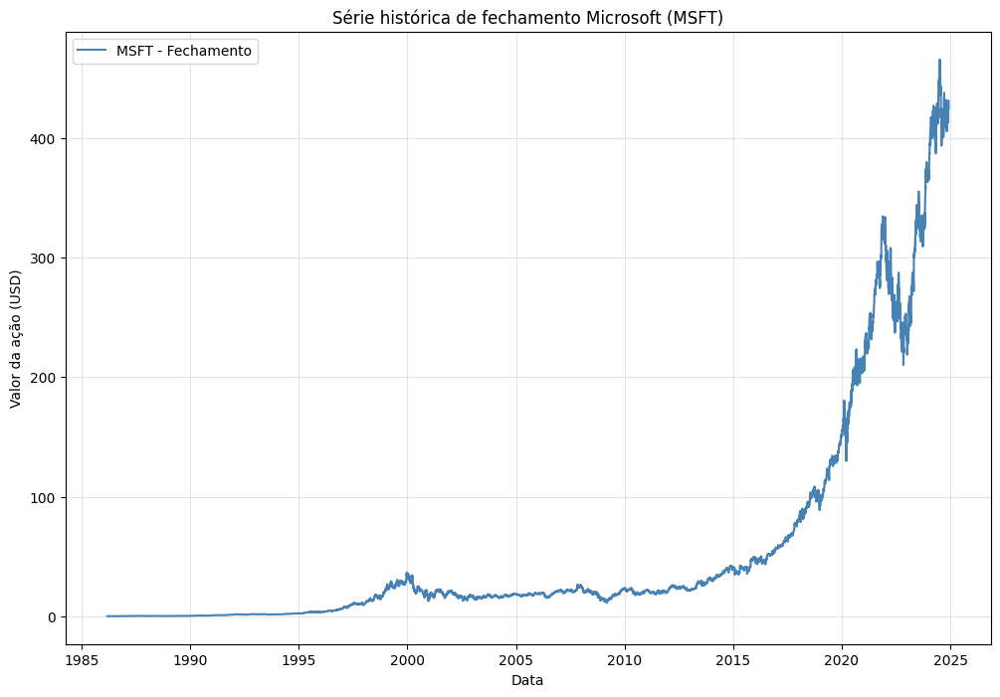

# Análise Histórica de Preços da Microsoft (MSFT)

Este projeto utiliza a biblioteca `yfinance` para acessar dados históricos das ações da Microsoft (ticker: MSFT) e cria um gráfico que exibe a série temporal dos preços de fechamento.

## Funcionalidades
- Download de dados históricos do ativo MSFT utilizando o `yfinance`.
- Visualização gráfica da série histórica dos preços de fechamento.
- Salva o gráfico gerado como uma imagem (`serie_hist_microsoft.png`).

## Pré-requisitos

Para executar o projeto, é necessário ter o Python instalado e as seguintes bibliotecas configuradas no ambiente:

- [yfinance](https://pypi.org/project/yfinance/)
- [numpy](https://pypi.org/project/numpy/)
- [matplotlib](https://pypi.org/project/matplotlib/)

### Instalação das dependências

Execute o comando abaixo para instalar as bibliotecas necessárias:

pip install yfinance numpy matplotlib

## Resultado
O script gera e exibe um gráfico da série histórica de preços de fechamento das ações da Microsoft (MSFT). A imagem também é salva localmente como serie_hist_microsoft.png.

Exemplo de gráfico gerado:

